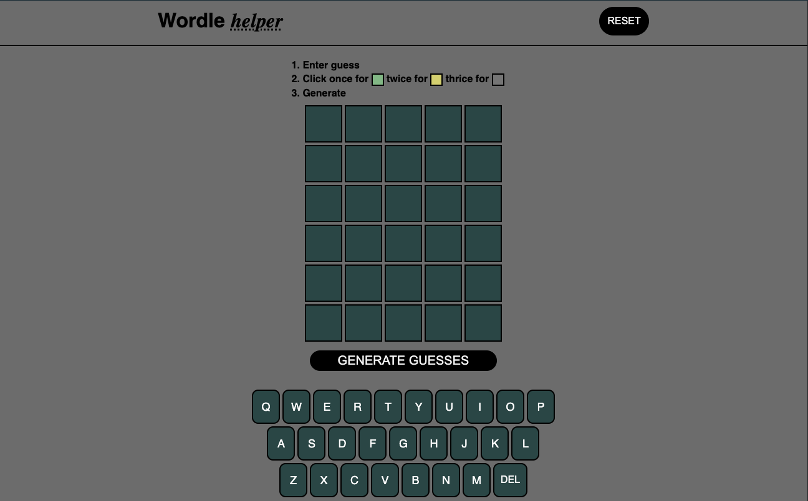

# Wordle Helper

[https://knightmac19.github.io/wh-mockup/](https://knightmac19.github.io/wh-mockup/)

### Stuck on a wordle? Input your guesses along with valid & invalid letters to get a list of possible wordles!

##  Languages & Technologies

[Contents](#contents)  

##  Contents

- [Languages](#languages)
- [Description](#description)
- [Features](#features)
- [Motivation](#motivation)
- [Challenges](#challenges)
- [Contributors](#contributors)
- [License](#license)

##  Description

[Contents](#contents)  
Users can input their guesses from a wordle game, highlighting letters as necessary and in the correct place, necessary but not in the correct place, and unnecessary, so that a list of possible 5-letter words can be generated.

##  Features

[Contents](#contents)  
The site is fully responsive and words both on mobile and desktop / laptop. A GUI keyboard is displayed so touchscreen users can also utilize the application.

##  Motivation

[Contents](#contents)  
After playing wordle for a while I started to wonder why players were given six guesses. Why not five guesses? Why not seven guesses? I reasoned that, given the list of possible words and some savvy guessing, a script should be able to narrow-down possible answers. Initially I made a terminal-based application. Since I wanted to share my app I turned it into a web application.

##  Challenges & Lessons Learned

[Contents](#contents)  
It was fun to build the app with only HTML, CSS, and vanilla JS. Looking back I could have used React to make the codebase a little slimmer and easier to maintain. Essentially the list of possible words starts from a large list then must be trimmed by each new requirement. One of the challenges was to run all those operations sequentially. This means that for the first or second guess it may take a few hundred milliseconds before results are rendered.

##  Contributors

[Contents](#contents)

- Patrick Dunn // [pmdunn78@gmail.com](mailto:pmdunn78@gmail.com) // [github.com/knightmac19](https://github.com/knightmac19)

##  Questions

[Contents](#contents)  
Please direct any questions to [pmdunn78@gmail.com](mailto:pmdunn78@gmail.com).

##  License

[Contents](#contents)  
Copyright 2022 Patrick Dunn

Permission is hereby granted, free of charge, to any person obtaining a copy of this software and associated documentation files (the "Software"), to deal in the Software without restriction, including without limitation the rights to use, copy, modify, merge, publish, distribute, sublicense, and/or sell copies of the Software, and to permit persons to whom the Software is furnished to do so, subject to the following conditions:

The above copyright notice and this permission notice shall be included in all copies or substantial portions of the Software.

THE SOFTWARE IS PROVIDED "AS IS", WITHOUT WARRANTY OF ANY KIND, EXPRESS OR IMPLIED, INCLUDING BUT NOT LIMITED TO THE WARRANTIES OF MERCHANTABILITY, FITNESS FOR A PARTICULAR PURPOSE AND NONINFRINGEMENT. IN NO EVENT SHALL THE AUTHORS OR COPYRIGHT HOLDERS BE LIABLE FOR ANY CLAIM, DAMAGES OR OTHER LIABILITY, WHETHER IN AN ACTION OF CONTRACT, TORT OR OTHERWISE, ARISING FROM, OUT OF OR IN CONNECTION WITH THE SOFTWARE OR THE USE OR OTHER DEALINGS IN THE SOFTWARE.
